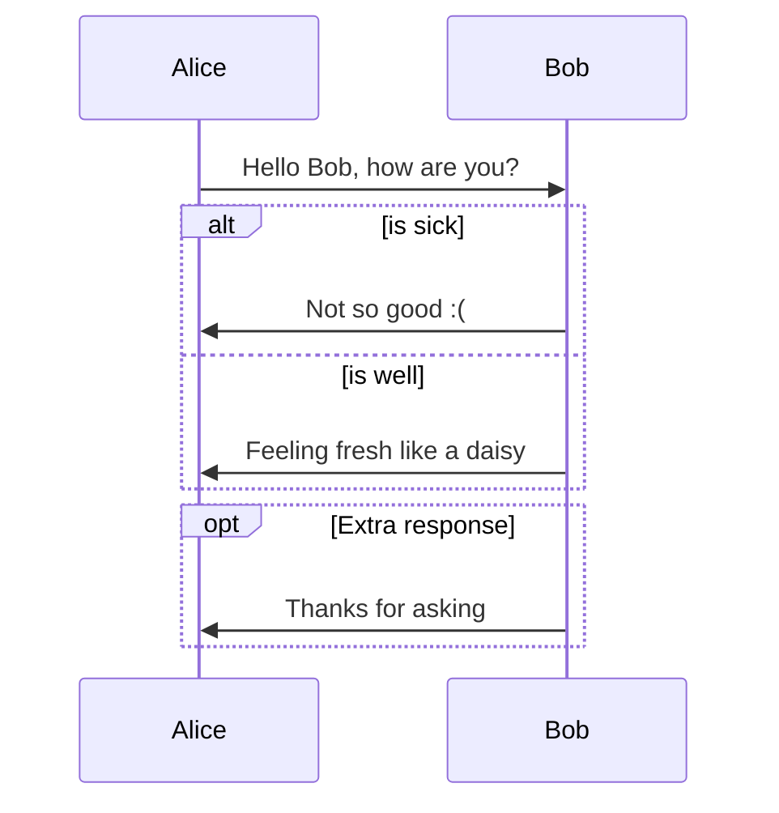
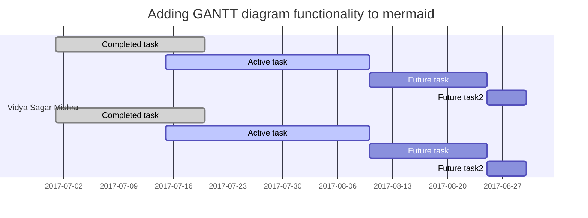

# Good Karma – Testing in AngularJS

```mermaid
%% Example of sequence disagram
	sequenceDiagram
	 Alice->>Bob: Hello Bob, how are you?
	 alt is sick
	 Bob->>Alice: Not so good :(
    else is well
    Bob->>Alice: Feeling fresh like a daisy
    end
    opt Extra response
    Bob->>Alice: Thanks for asking
    end
```

```mermaid
gantt
dateFormat  YYYY-MM-DD
title Adding GANTT diagram functionality to mermaid
section Vidya Sagar Mishra
Completed task            :done,    des1, 2017-07-01,2017-07-20
Active task               :active,  des2, 2017-07-15, 26d
Future task               :         des3, after des2, 15d
Future task2              :         des4, after des3, 5d
section Vidya Sagar Mishra
Completed task            :done,    des1, 2017-07-01,2017-07-20
Active task               :active,  des2, 2017-07-15, 26d
Future task               :         des3, after des2, 15d
Future task2              :         des4, after des3, 5d
```

| Default | Left  | Right | Center |
| ------- | :---- | ----: | :----: |
| cell1   | cell2 | cell3 | cell4  |